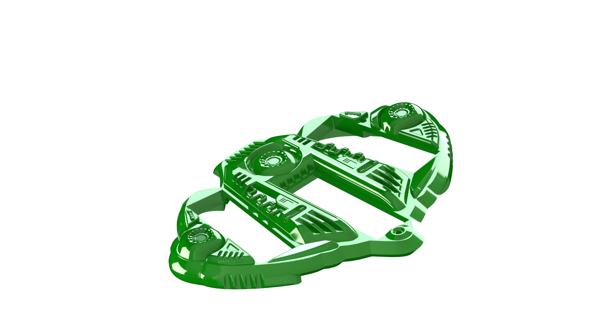

<!--
*** Thanks for checking out the Best-README-Template. If you have a suggestion
*** that would make this better, please fork the repo and create a pull request
*** or simply open an issue with the tag "enhancement".
*** Don't forget to give the project a star!
*** Thanks again! Now go create something AMAZING! :D
-->

<!-- PROJECT SHIELDS -->
<!--
*** I'm using markdown "reference style" links for readability.
*** Reference links are enclosed in brackets [ ] instead of parentheses ( ).
*** See the bottom of this document for the declaration of the reference variables
*** for contributors-url, forks-url, etc. This is an optional, concise syntax you may use.
*** https://www.markdownguide.org/basic-syntax/#reference-style-links
-->

<!-- PROJECT LOGO -->
 
   
  <h1 align="center">Super 2024 Swadge Barrier Shell</h1>

  

    Protect your Gunship

### Built With
 

* [Fusion 360]( https://www.autodesk.com/products/fusion-360/overview?term=1-YEAR&tab=subscription) 
* [SOLIDWORKS 2022](https://www.solidworks.com) 
* [Blender](https://www.blender.org) 

(<a href="#top">back to top</a>)

<!-- GETTING STARTED -->
## Getting Started
 
The Barrier Shell 3D design team comprised of Erik Jacobs, Greg Lord, and Emily Anthony created two shell variants for Super Prime 2024:

* A clever model optimized for printing sans supports, open for customization and creative usage of infill for FDM printers
* A massively detailed render of a ship hull for injection molding

Injection Molded shells are only available at the Fangamer Merch Booth at Super Prime 2024.

To print your own simple model:
 
Identify which type of printing technology you’d like to use to replicate your Barrier Shell It’s sincerely not recommended to use the Injection Molding files for FDM printers, though you could (probably) SLA it with some adjustment. This print has not been tested with SLS. 
 

### Materials

Materials required vary based on your printing method. It is recommended to print the FDM Shell with PETG, but really you can use any filament on hand.

You’ll need:

An FDM 3D printer with a minimum build volume of 150mm x 150mm x 10mm. The Barrier Shell was designed to minimize excess support structure and should be printed flat.

OR

An SLA printer capable of printing UV resin with a minimum build volume of 150mm x 90mm x 90mm.

OR

Money to spend at www.HUBS.com or www.shapeways.com to outsource prints.

OR

Stop by the Makerspace at Super Prime 2024 to print your own!

### Assembly

FDM and SLA prints are assembled differently. IF you are using a tappable resin such as Siraya Tech Build, you may be able to use the FDM mounting hardware. YMMV.

FDM Fasteners:

Any M3 x 8mm self tapping screw. The Barrier Shells were delivered at MAGFest 2024 with these screws.

SLA Fasteners:

Most resin is not tappable. We’d recommend using an M3 x ~14mm screw and a nut.
 

(<a href="#top">back to top</a>)

<!-- CONTRIBUTING -->
## Contributing

Contributions are what make the open-source community such an amazing place to learn, inspire, and create. Any contributions you make are **greatly appreciated**.

If you have a suggestion that would make this better, please fork the repo and create a pull request. You can also simply open an issue with the tag "enhancement".
Don't forget to give the project a star! Thanks again!

1. Fork the Project
2. Create your Feature Branch (`git checkout -b feature/AmazingFeature`)
3. Commit your Changes (`git commit -m 'Add some AmazingFeature'`)
4. Push to the Branch (`git push origin feature/AmazingFeature`)
5. Open a Pull Request

(<a href="#top">back to top</a>)

<!-- LICENSE -->
## License

<a property="dct:title" rel="cc:attributionURL" href="https://github.com/AEFeinstein/Super-2024-Swadge-HW/tree/main/Swadge-HW/3D-Print">Swadge Barrier Shell</a> by <a rel="cc:attributionURL dct:creator" property="cc:attributionName" href="https://github.com/emilyanthony4244">Emily Anthony</a> is licensed under <a href="http://creativecommons.org/licenses/by-nc-sa/4.0/?ref=chooser-v1" target="_blank" rel="license noopener noreferrer" style="display:inline-block;">CC BY-NC-SA 4.0</a>

<!-- CONTACT -->
## Contact

Emily Anthony - [@thelegendofemily](https://www.thelegendofemily.com) 

Greg Lord –
[@gplord]( https://www.gplord.com/)

Erik Jacobs 

Project Link: https://github.com/AEFeinstein/Super-2024-Swadge-HW/

(<a href="#top">back to top</a>)

<!-- ACKNOWLEDGMENTS -->
## Acknowledgments

* The Swadge team for idea generation, continuous feedback, and excellent vibes
* MAGFest volunteers and employees for their overwhelming support and willingness to help push this side project
* [OthNealDrew’s Readme template]( https://github.com/othneildrew/Best-README-Template)

(<a href="#top">back to top</a>)

<!-- MARKDOWN LINKS & IMAGES -->
<!-- https://www.markdownguide.org/basic-syntax/#reference-style-links -->
[contributors-shield]: https://img.shields.io/github/contributors/emilyanthony4244/Sheikah_Slate.svg?style=for-the-badge
[contributors-url]: 
https://github.com/AEFeinstein/Super-2024-Swadge-HW/graphs/contributors

